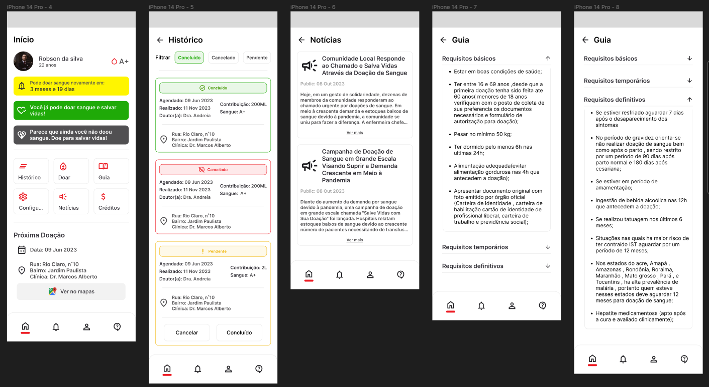

# BLOOD BANK

> O Blood Bank é um aplicativo para dispositivos móveis oferecido de forma gratuita. Ele tem como objetivo facilitar a coleta de doadores de sangue, apoiando os hemocentros da rede pública de saúde ao divulgar informações relevantes para o público e promover campanhas de doação de sangue.

## 🤝 Colaboradores

Às seguintes pessoas que contribuíram para este projeto:

<table>
  <tr>
    <td align="center">
      <a href="#" title="defina o titulo do link">
         
        
          <b>Marcelo Zioli</b>
        
        
          <b>Front-end</b>
        
      </a>
    </td>
    <td align="center">
      <a href="#" title="defina o titulo do link">
         
        
          <b>João Lucas Buzzo</b>
        
        
          <b>Back-end</b>
        
      </a>
    </td>
    <td align="center">
      <a href="#" title="defina o titulo do link">
         
        
          <b>João L. Barboza</b>
        
        
          <b>UX Designer</b>
        
      </a>
    </td>
  </tr>
</table>

## 📝 Licença

Mais informaões sobre o projeto. Veja no site [HubInova FEMA](https://hub.fema.edu.br/).